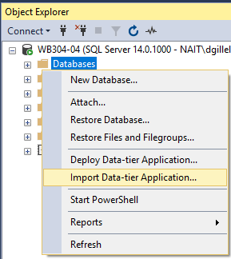
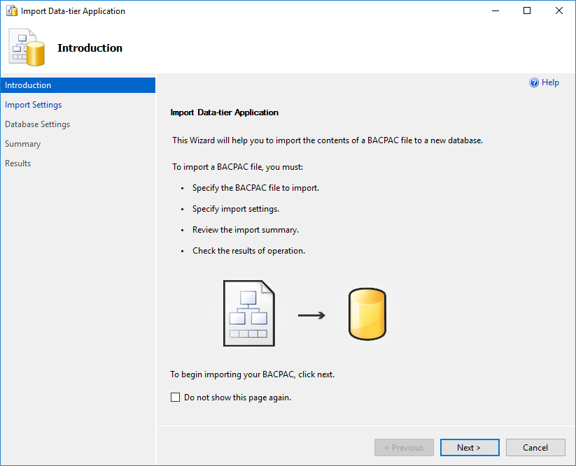
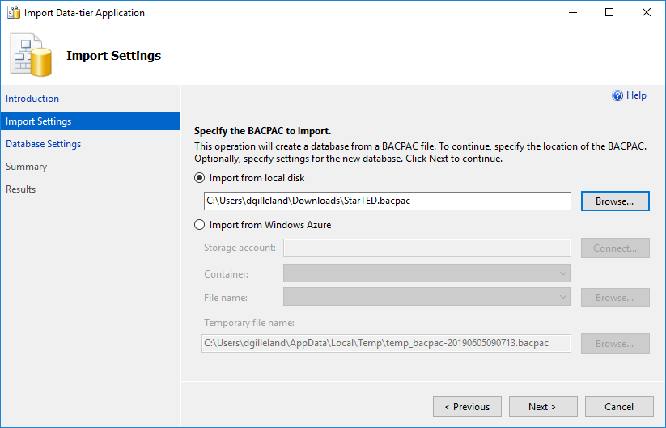
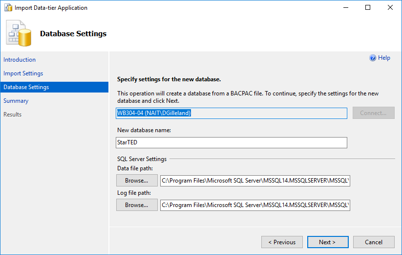
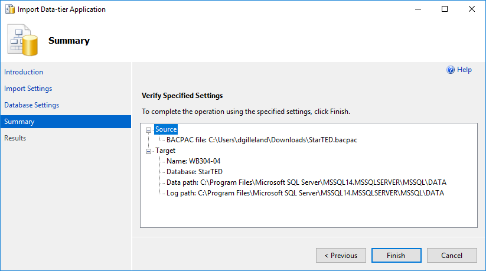
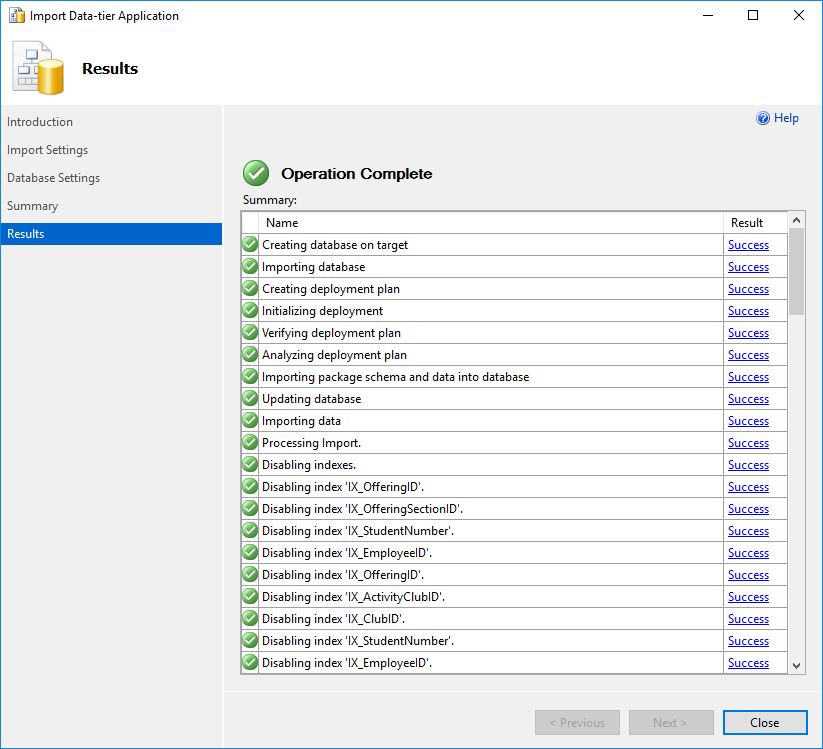
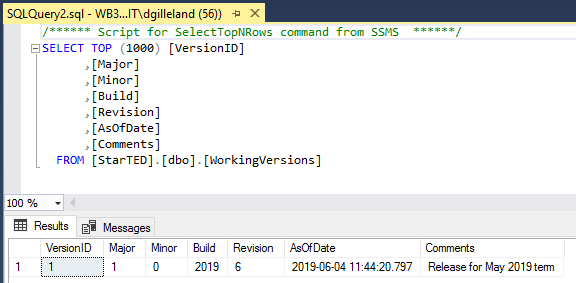

# Lab Database

The lab's database - [**StarTED.bacpac**](./StarTED.bacpac) - is available as a Data-tier Application.

## Installing a Bacpac

Open **SSMS** (*Sql Server Management Studio*) and begin by right-clicking on the `Databases` folder and selecting **Import Data-tier Application...**. Follow the steps of the dialog to select your *.bacpac* and install it on your database server.

