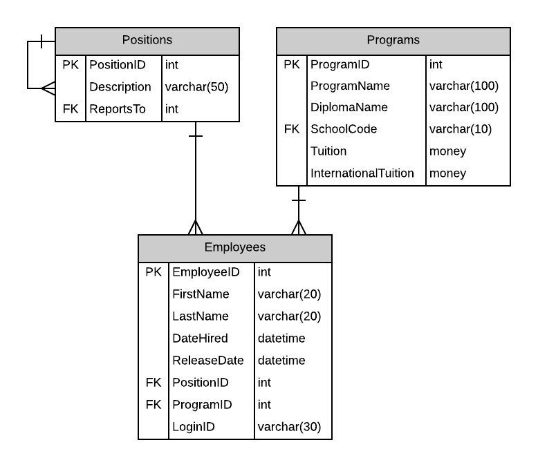
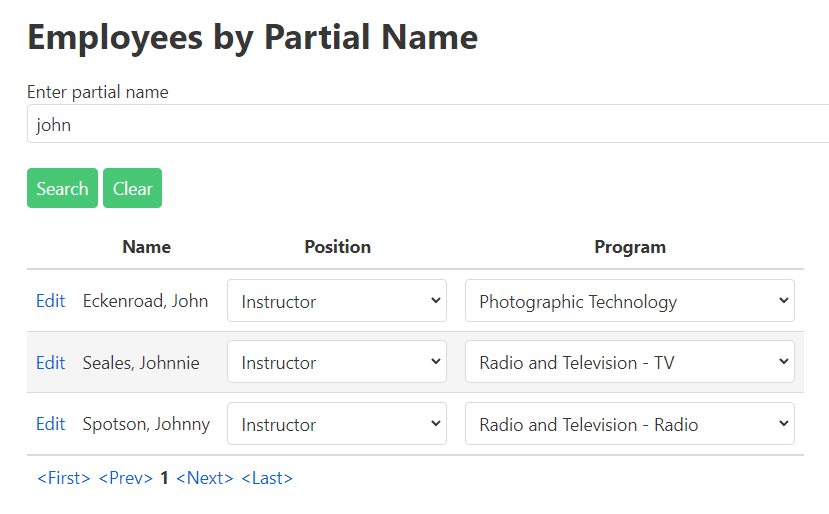

# A01: Employees

You must create two pages (Query and CRUD) based on the following database tables. You will create the entities by using reverse engineering.



## Special NOTE:

When using the entity Program in variable declarations you **must** use the **fully qualified class name** as the datatype. Example: **MySystemName.Entities.Program** somepropertyname {get;set;}.  

Why? The web application project also has a class called Program. The system will get confused betweem the two if you do not use the fully qualified name.

## Query

> **Employees by Partial Name** - Search with Tabular Results 

Display the results of looking up Employees by a partial name string for active employees (non-released). The partial name string can be found in either the first or last name. The program and position drop-down displays are alphabetic. Display the employee fullname, program and position. Follow the mock-up below as a guide to displaying the results. Remember to include pagination.

Each employee line will contain a link to allow for record maintenance. This link will cause your CRUD page to appear. Add a separate New button to have your CRUD appear.

- **Search Filter:**



## CRUD

> **Employees** - Single Item Create/Read/Update/Delete

- Employees cannot be deleted. Employees are terminated. Employees have a nullable `ReleaseDate` which is set to indicate the employee is no long with the school.
- Include a not mapped property called FullName when creating the Employee entity definition. This property will return a string containing the LastName, Firstname of the employee.
- Forms must allow the user to select/view position and program from a list of data currently on the database.

**Queries**

Program List

```csharp
_context.Programs
        .OrderBy(x => x.ProgramName)
```

Position List

```csharp
_context.Positions
        .OrderBy(x => x.Description)
```

Employee by partial name

```csharp
_context.Employees
        .Where(x => x.LastName.Contains(partialname)
                || x.FirstName.Contains(partialname))
        .OrderBy(x => x.LastName)
        .ThenBy(x => x.FirstName)
```

Employee by ID

```csharp
_context.Employees
        .Where(x => x.EmployeeId.Equals(employeeid))
        .FirstOrDefault()
```
