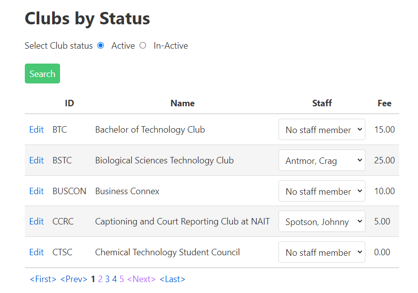

# A02: Clubs

You must create two pages (Query and CRUD) based on the following database tables. You will create the entities by using reverse engineering.


## Query

> **Clubs by Active Status** - Search with Tabular Results

Display the results of looking up Clubs by their active status (active/non-active). The employee drop-down has only employees active with clubs. Follow the mock-up below as a guide to displaying the results. Remember to include pagination.

Each club line will contain a link to allow for record maintenance. This link will cause your CRUD page to appear. Add a separate New button to have your CRUD appear.



## CRUD

> **Clubs** - Single Item Create/Read/Update/Deactivate (Delete)

Note the following:

- `Club` entries are **not** deleted. Rather than providing a "delete" button, inlude a "Deactivate" button and in the BLL method, change the `Active` flag to `false` and update the database for that entry.
- For entering the employee id of available staff, use an `<input>` with a `<datalist>`. The datalist is based the results of a query returning only employees who are instructors, office administrator or technical support.


**Queries**

Employee Club List

```csharp
_context.Employees
        .Where(x => x.Clubs.Any(y => x.EmployeeId == y.EmployeeId))
        .OrderBy(x => x.LastName)
```

Club by Status

```csharp
_context.Clubs
        .Where(x => x.Active == active)
        .OrderBy(x => x.ClubName)
```

Note: The radio button supplied a string, your service will need code to set a local boolean variable (active). 

Club by ID

```csharp
_context.Clubs
        .Where(x => x.ClubID.Equals(clubid))
        .FirstOrDefault()
```

Available Staff for Clubs

```csharp
_context.Employee
        .Where(x => x.PositionId == 3 || x.PositionId == 4 || x.PositionId == 5)
        .OrderBy(x => x.LastName);
```

**Entity Employee Entity**

Add the following to the entity for use in your application:

```csharp
[NotMapped]
public string FullName { get {return LastName + ', ' + Firstname;}}
```
