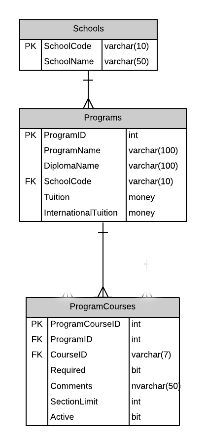
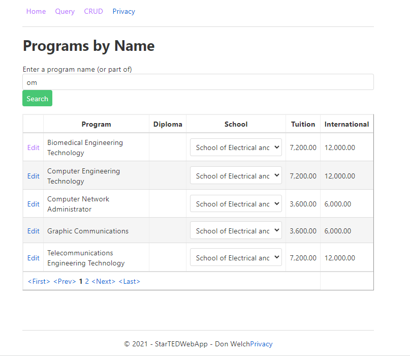

# A03: Programs

You must ceate two pages (Query / CRUD) based on the following database tables. You will create the entities by using reverse engineering.



## Special NOTE:

When using the entity Program in variable declarations you **must** use the **fully qualified class name** as the datatype. Example: **MySystemName.Entities.Program** somepropertyname {get;set;}.  

Why? The web application project also has a class called Program. The system will get confused betweem the two if you do not use the fully qualified name.

## Query

> **Programs by Program Name** - Search with Tabular Results

Display the results of looking Programs by Program Name. The user will be able to enter the program name or portion of the name. The result of the query will be a table presentation of the Programs containing the search argument. The SchoolCode will be a dropdown list displaying the school name. Your program record must have the appropriate school name displayed. Remember to include pagination.

Each program line will contain a link to allow for record maintenance. This link will cause your CRUD page to appear. Add a separate New button to have your CRUD appear.



## CRUD

> **Programs** - Single Item Create/Read/Update/Delete

**Note the following:**
- Use a select control to displays Schools, showing the school name. The select control is to have a prompt line.
- Programs with program courses cannot be removed.

**Queries**

School List

```csharp
_context.Schools
        .OrderBy(x => x.SchoolName)
```

Programs by Name

```csharp
_context.Programs
        .Where(x => x.ProgramName.Contains(partialname))
        .OrderBy(x => x.ProgramName)
```

Program by ID

```csharp
_context.Programs
        .Where(x => x.ProgramID == programid)
        .FirstOrDefault()
``` 

Program Course Count 

item is the parameter name; 

returns the number of ProgramCourses associated with the Program instance.

```csharp
_context.ProgramCourses.Where(x => x.Program.ProgramId == item.ProgramId).Count();
```
