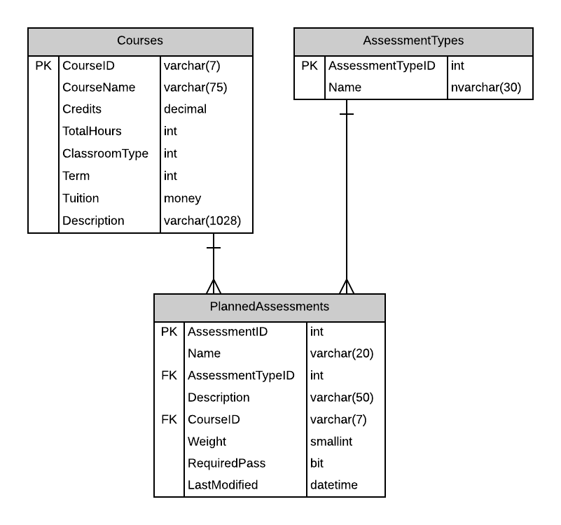
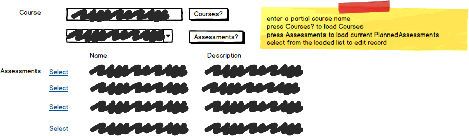

# A05: Planned Assessments

::: danger Scenario Not Available
This scenario is not available for selection at this time.
:::

You must do two web form pages (Query and CRUD) based on the following database tables.

## CRUD

> **PlannedAssessments** - Single Item Create/Read/Update/Delete

- Provide a prompt line to ensure the user selects a Course (no default).
- **Search Filter:**
  - Use Course partial name filtering for Courses lookup then select course for a list of current PlannedAssessments
  
  
  
- **Add/Edit Detail Filter:**
  - Use Course partial name filtering for foreign key: CourseID
  - Add a separate button to the search filter (above) after the Assessments button to assign the selected course as the foreign key value.

## Query

> **PlannedAssessments by Course** - Gridview Lookup with ObjectDataSource controls

- Avoid the use of code-behind in the form wherever possible.

- Use the Course Partial Name filtering for your query.

- Assessment Type will display the type Name within a drop down list.

## Recommended Stored Procedures

The following specialty stored procedures are available:

- `PlannedAssessments_FindByCourse` - Returns zero or more PlannedAssessments matching the supplied course id
- `Courses_FindByPartialName` - Returns zero or more Courses whos course name includes the supplied string
