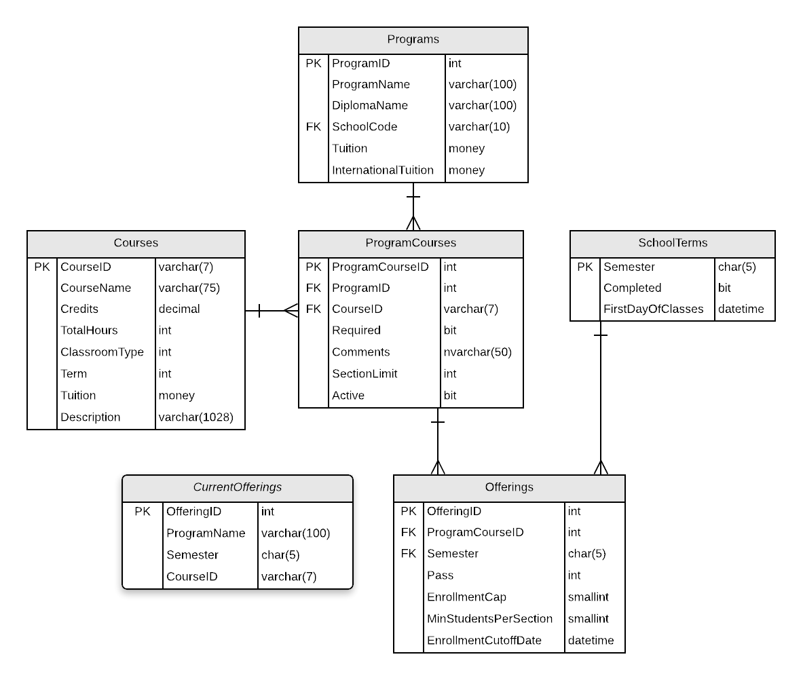
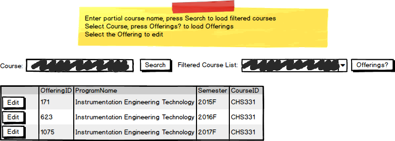
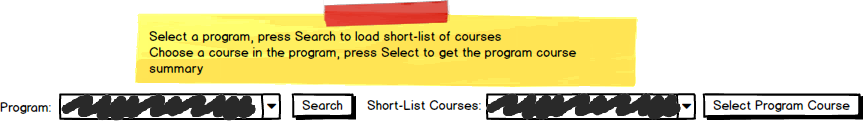

# A06: Offerings

::: danger Scenario needs Instructor Approval 

This scenario is available for selection but instructor approval must be obtained.
:::

You must do two web page pages (Query and CRUD) based on the following database **tables** and **views**.

## CRUD

> **Offerings** - Single Item Create/Read/Update/Delete

- Only Offerings for current or future semesters can be updated or deleted.
- Create a Not-Mapped annotation property in the ProgramCourse entity which will return a string formatted to  `courseid (programid)`. Example `BAI3990 (2)`.
- **Search Filter:**
  - Use a multi-step filter to find the offering to edit: Find a list of courses to select from using the partial course name; select the course to get the current offerings; select the offering to edit.
  
  
  
- **Add/Edit Detail Filters:**
  - Select a program to get a short-list of courses in the program (`ProgramCourseSummary`); select the program course summary to use for the `ProgramCourseID` foreign key

## Query

::: danger Scenario Not Available
This scenario is not available for selection at this time.
:::

> **Offerings by Course** - Gridview Lookup with ObjectDataSource controls

- Avoid the use of code-behind in the form wherever possible.
- Use Course partial name filtering
- Display the course and program Not-Mapped annotation property in the GridView using a Drop-Down List control for the `ProgramCourseId` foreign key value. 

## Recommended Stored Procedures

The following specialty stored procedures are available:

- `CurrentOfferings_FindByCourse` - Returns zero or more CurrentOfferings records matching the supplied course id
- `Offerings_FindByCourse` - Returns zero or more Offerings records matching the supplied course id
- `Courses_FindByProgram` - Returns zero or more Courses belonging to the supplied program id
- `Courses_FindByPartialName` - Returns zero or more Courses belonging to the supplied partial course name
- `Semesters_FindActiveFuture` - Returns zero or more SchoolTerms records currently active or are future semseters

<!--
- `ProgramCourseSummary_FindByCourse` - Returns zero or more ProgramCourseSummary records matching the supplied partial course id or course name
- `Offerings_FindByProgramCourseAndSemester` - Returns zero or 1 Offerings records matching the supplied program id, course id and semester
- `ProgramCourses_FindByProgramAndCourse` - Returns zero or 1 ProgramCourse records matching the supplied program id and course id
-->
