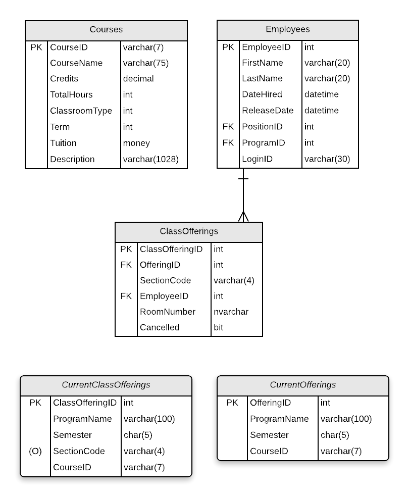
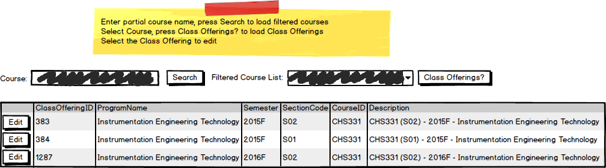
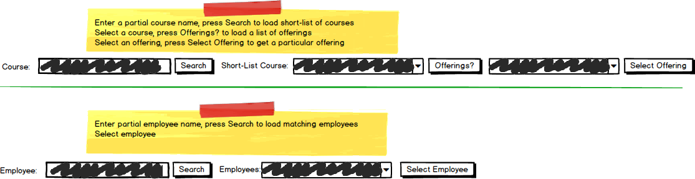

# A07: Class Offerings

::: danger Scenario Not Available
This scenario is not available for selection at this time.
:::

::: danger Scenario needs Instructor Approval 

This scenario is available for selection but instructor approval must be obtained.
:::

You must do two web form pages (Query and CRUD) based on the following database **tables** and **views**.

## CRUD

> **ClassOfferings** - Single Item Create/Read/Update/Delete

- Only ClassOfferings for current or future semesters can be updated.
- ClassOfferings cannot be physically deleted; clicking the [Delete] button should *cancel* the ClassOffering. ClassOfferings have a cancel flag which is set to indicate the classoffering is cancelled. Set this flag in your BLL method, not in the code-behind of the form.
- Include a not-mapped property called `FullName` when creating the Employee entity definition. This property must return a string containing the LastName, Firstname of the employee.
- **Search Filters:**
  - Filtering for ClassOffering lookup: Course (Courses filter by Program) for course list, select course to get class offering list, select from this list for editing
  
  
  
- **Add/Edit Detail Filters:**
  - Use Offering list filtering for Offerings lookup: select from a list offerings of specific Offering
  - Use employee firstname/lastname filtering for foreign key `EmployeeID`

## Query

> **ClassOfferings by Course** - GridView Lookup with ObjectDataSource controls

- Avoid the use of code-behind in the form wherever possible.
- Use a two step filter to find the course id. Find a list of courses to select from using the partial course name.
- Display the Employee in the GridView using a Drop-Down List control. Show the Employee's full name.

## Recommended Stored Procedures

The following specialty stored procedures are available:

- `Courses_FindByPartialName` - Returns zero or more Courses whose Course ID or Description matches a partial name
- `CurrentClassOfferings_FindByCourse` - Returns zero or more rows from the *CurrentClassOfferings* view for the supplied course ID.
- `CurrentOfferings_FindByCourse` - Returns zero or more rows from the *CurrentOfferings* view for the supplied course ID.
- `Employees_FindByPartialName` - Returns zero or more Employees whos first or last name includes the supplied string
