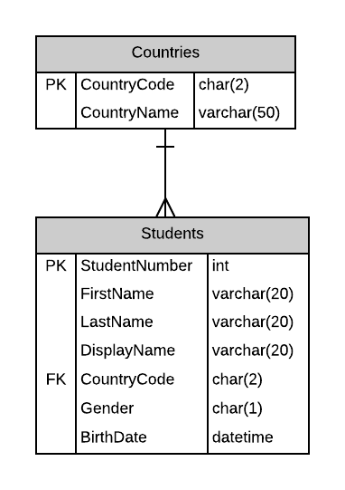
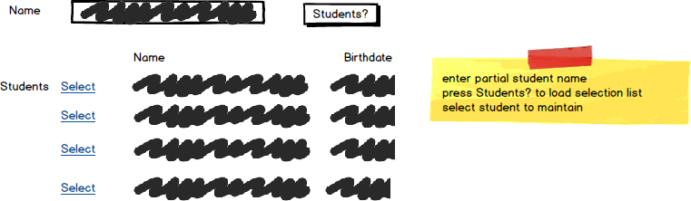

# A08: Students

::: danger Scenario Not Available
This scenario is not available for selection at this time.
:::

You must do two web form pages (Query and CRUD) based on the following database tables.

## CRUD

> **Students** - Single Item Create/Read/Update/Delete

- Include a not mapped property called FullName when creating the Student entity definition. This property will return a string containing the LastName, Firstname of the student.
- **Search Filter:**
  - Use Student partial name filtering for Students lookup 

## Query

> **Students by Gender** - Gridview Lookup with ObjectDataSource controls

- Avoid the use of code-behind in the form wherever possible.
- Display the full country name for the `CountryCode` foreign key by using a Drop-Down List control in the GridView.

## Recommended Stored Procedures

The following specialty stored procedures are available:

- `Students_FindByGender` - Returns zero or more Students records whos gender matches the supplied gender
- `Students_FindByPartialName` - Returns zero or more Students whos first or last name includes the supplied string
