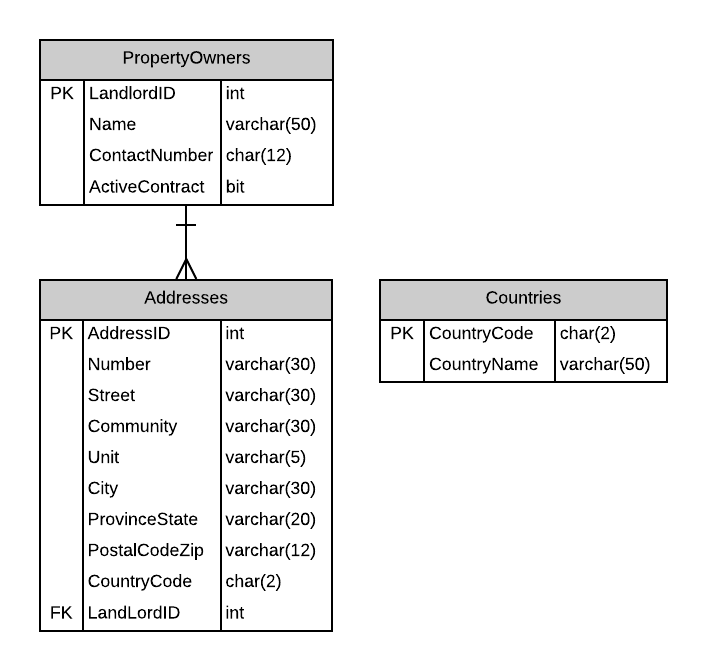
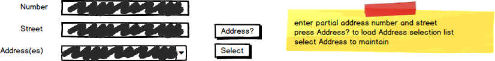

# A09: Addresses

::: danger Scenario Not Available
This scenario is not available for selection at this time.
:::

You must do two web form pages (Query and CRUD) based on the following database tables.

## CRUD

> **Addresses** - Single Item Create/Read/Update/Delete

- There is a table trigger requiring the Country Code to match one of the existing country codes in the Countries table. You must use a Drop-Down for the Address' `CountryCode` and LandLord (PropertyOwner).
- Set a prompt on each Drop-Down to be used as None. 
- Include a not-mapped property called `Fulladdress` when creating the Address entity definition. This property will return a string containing the full address using the format `number street (unit)`. Only add the (unit) if the unit is not null. Examples: `1001 14 Ave` or `12015 109 St (A215)`
- **Search Filter:**
  - Search for possible addresses using a partial address number and street

## Query

> **Addressses by Landlord** - Gridview Lookup with ObjectDataSource controls

- Avoid the use of code-behind in the form wherever possible.
- Do not display the `Landlord` attribute.
- Use a Drop-Down to display the Country name.

## Recommended Stored Procedures

The following specialty stored procedures are available:

- `Addresses_FindByLandlord` - Returns zero or more Addresses matching the supplied Landlord id
- `Addresses_FindByPartialStreetAddress` - Returns zero or more Addresses whos Number and Street contains the supplied values.
