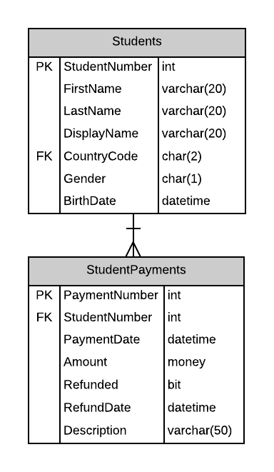
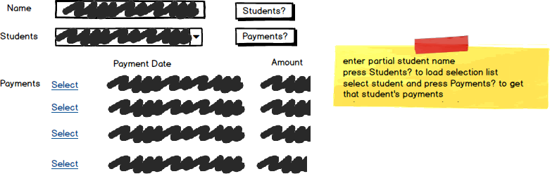

# A10: Student Payments

::: danger Scenario Not Available
This scenario is not available for selection at this time.
:::

::: danger Scenario Not Available
This scenario is not available for selection at this time.
:::

You must do two web form pages (Query and CRUD) based on the following database tables.

## CRUD

> **StudentPayments** - Single Item Create/Read/Update/Delete

- Payments must have a student id (no default).
- Payment: StudentPayments `Paymentdate` must be set when a payment is made.
- Refund: Create a new record in StudentPayments. `Refunded` and `RefundDate` must be set for a refund.
- StudentPayments records are never deleted.
- Include a not-mapped property called `FullName` when creating the Student entity definition. This property will return a string containing the `LastName, Firstname (BirthDate)` of the student.
- **Search Filter:**
  - Use a Student Name partial filter search for finding the Student. Select the student to find the student's payments.

## Query

> **StudentPayments by Student** - Gridview Lookup with ObjectDataSource controls

- Avoid the use of code-behind in the form wherever possible.

## Recommended Stored Procedures

The following specialty stored procedures are available:

- `Students_FindByPartialName` - Returns zero or more Students whos first or last name includes the supplied string
- `StudentPayments_FindByStudent` - Returns zero or more StudentPayments records matching the supplied student id
