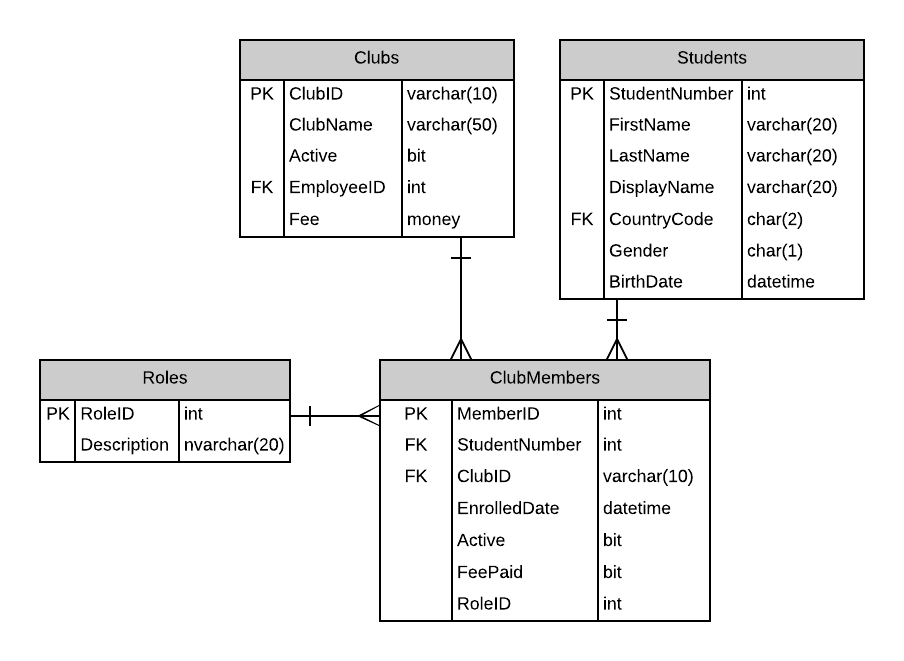
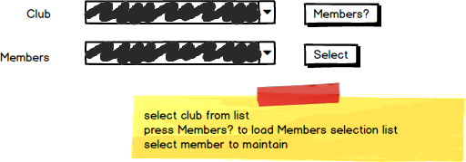
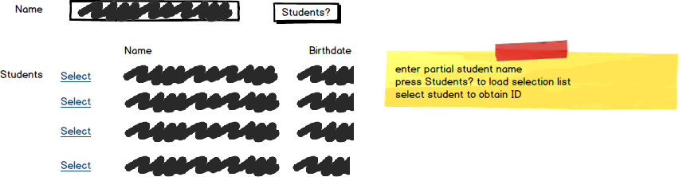

# A11: Club Members

::: danger Scenario Not Available
This scenario is not available for selection at this time.
:::

You must do two web form pages (Query and CRUD) based on the following database tables.

## CRUD

> **ClubMembers** - Single Item Create/Read/Update/Delete

- ClubMembers are not deleted. ClubMembers are made inactive. There is an Active flag in ClubMembers.
- Obtain the role from a list of role descriptions
- Include a not-mapped property called `FullName` when creating the Student entity definition. This property will return a string containing the `LastName, Firstname` of the student.
- **Search Filter:**
  - Use filtering on club obtaining clubmember student list. Select from the member list for the specific clubmember.
  
  
  
- **Add/Edit Detail Filter:**
  - Use student firstname/lastname filtering for foreign key: StudentID

## Query

> **ClubMembers by Club** - Gridview Lookup with ObjectDataSource controls

- Avoid the use of code-behind in the form wherever possible.
- Obtain the role from a list of role descriptions and display in a Drop-Down List control for the foreign key.

## Recommended Stored Procedures

The following specialty stored procedures are available:

- `ClubMembers_FindByClub` - Returns zero or more ClubMembers matching the supplied club id
- `Students_FindByPartialName` - Returns zero or more Student records where the first or last name contain the partial name supplied
