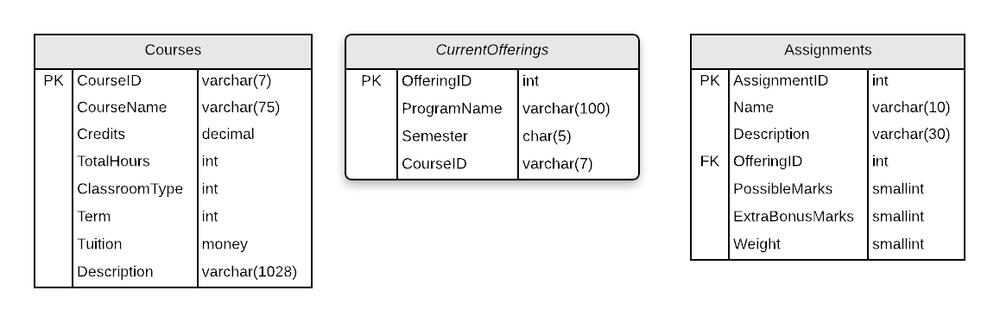

# A12: Assignments

::: danger Scenario Not Available
This scenario is not available for selection at this time.
:::

::: danger Scenario needs Instructor Approval 

This scenario is available for selection but instructor approval must be obtained.
:::

You must do two web form pages (Query and CRUD) based on the following database tables.

## CRUD

> **Assignments** - Single Item Create/Read/Update/Delete

- Only Assignments for current or future semesters can be updated or deleted.

- **Search Filter:**
  - Use a multi-step filter to find the offering to edit: Find a list of courses to select from using the partial course name; select the course to get the current offerings; select the offering to load the assignments; select the assignment to edit.
  
 
  
- **Add/Edit Detail Filter:**
  - Use Offering list filtering for Offerings lookup: select from a list offerings of specific Offering

## Query

> **Assignments by Offering** - Gridview Lookup with ObjectDataSource controls

- Avoid the use of code-behind in the form wherever possible.

## Recommended Stored Procedures

The following specialty stored procedures are available:

- `Assignments_FindByOffering` - Returns zero or more Assignments records matching the offering id
- `CurrentOfferings_FindByCourse` - Returns zero or more CurrentOfferings records matching the supplied course id
- `Courses_FindByPartialName` - Returns zero or more Courses records matching the supplied course partial name
