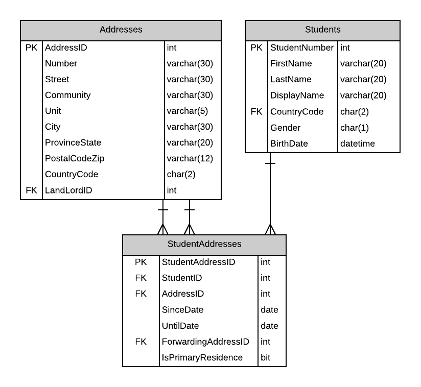
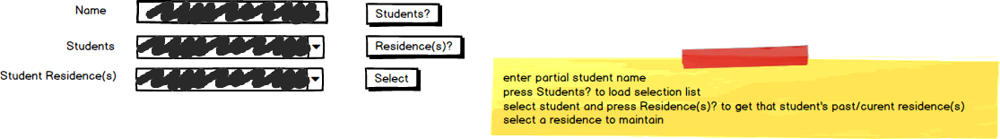
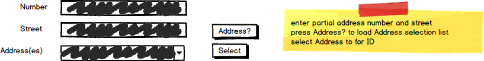

# A13: Student Addresses

::: danger Scenario Not Available
This scenario is not available for selection at this time.
:::

You must do two web form pages (Query and CRUD) based on the following database tables.

## CRUD

> **StudentAddresses** - Single Item Create/Read/Update/Delete

- StudentAddresses are not to be physically deleted. StudentAddresses are in effect until the UntilDate has been set.
- Include a not-mapped property called FullAddress when creating the Address entity definition. This property will return a string containing the full address using the format `number street (unit)`. Only add the (unit) if the unit is not null. Examples `1001 14 Ave` or `12015 109 St (A215)`
- **Search Filter:**
  - Use Student firstname/lastname filter for main Student Residence lookup (find all address for a specific student): 
  
  
  
- **Add/Edit Detail Filter:**
  - Use Address filter (Number and Street) search for new Address and ForwardingAddress foreign keys.

## Query

> **StudentAddresses by Residency Since Date** - Gridview Lookup with ObjectDataSource controls

- Find all StudentAddresses whos SinceDate is within a date range (date A and date B).
- Avoid the use of code-behind in the form wherever possible.
- Display the FullAddress for Address and FowardingAddress.

## Recommended Stored Procedures

The following specialty stored procedures are available:

- `Students_FindByPartialName` - Returns zero or more Students whos first or last name includes the supplied string
- `StudentAddressess_FindByStudent` - Returns zero or more StudentAddresses matching the supplied student id
- `Addresses_FindByPartialStreetAddress` - Returns zero or more Addresses whos Number and Street contains the supplied values.
- `StudentAddressess_FindByDateRange` - Returns zero or more StudentAddresses whos SinceDate is within a date range (date A and B)
