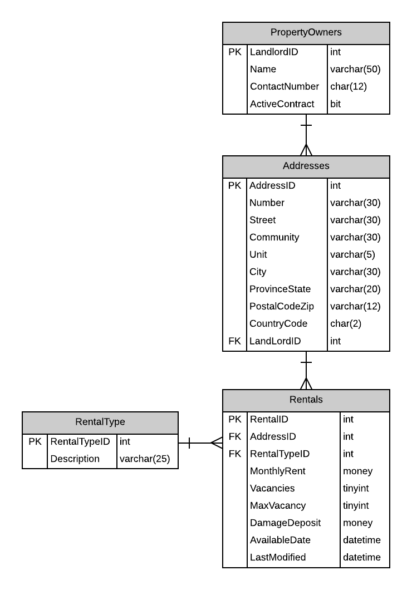
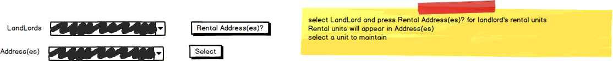
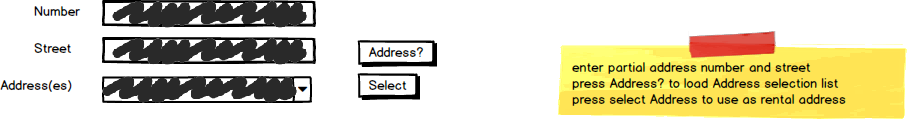

# A15: Rentals

::: danger Scenario Not Available
This scenario is not available for selection at this time.
:::

You must do two web form pages (Query and CRUD) based on the following database tables.

## CRUD

> **Rentals** - Single Item Create/Read/Update/Delete

- `MaxVacancy` is the legal number of individual allowed in the unit. Example, a 4 bedroom unit would allow up to 4 individuals in the unit. The monthly rent is for the unit regardless of the number of individuals renting the unit.
- Include a not-mapped property called `FullAddress` when creating the Address entity definition. This property will return a string containing the full address in the format `number street (unit)`. Only add the (unit) if the unit is not null. Examples `1001 14 Ave` or `12015 109 St (A215)`
- LandLord name and Rental type descriptions lists can be obtained from the database for used on the respective forms. 
- **Search Filter:**
  - Use the LandLord filter and Addresses belonging to the landlord for Rental maintenance 
  
  
  
- **Add/Edit Detail Filter:**
  - Use Address (Number and Street) filtering for Address lookup for altering or creating a new rental unit 

## Query

> **Rentals by MonthlyRate Range** - Gridview Lookup with ObjectDataSource controls

- Avoid the use of code-behind in the form wherever possible.

## Recommended Stored Procedures

The following specialty stored procedures are available:

- `Rentals_FindByLandlord` - Returns zero or more Rentals records for the supplied landlord id
- `Addresses_FindByPartialStreetAddress` - Returns zero or more Addresses whos Number and Street contains the supplied values.
- `Rentals_FindByMontlyRateRange` - Returns zero or more Rentals whos MonthlyRent is within a specified range.
