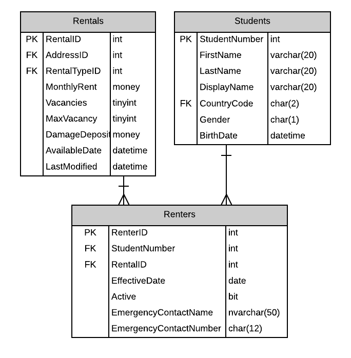

# A16: Renters (not available)

::: danger Scenario Not Available
This scenario is not available for selection at this time.
:::

You must do two web form pages (Query and CRUD) based on the following database tables.

## CRUD

> ****

- **Search Filter:**

You must filter the list of possible Students to select from in order to assign an Student to the Renter. Use the supplied stored procedure to create the filtered list. The supplied stored procedure will raise an error if the results are too large. Provide a prommpt line to ensure the user selects a Student (no default).

## Query

- Avoid the use of code-behind in the form wherever possible.

**Recommended Stored Procedures** - The following specialty stored procedures are available:

`Students_FindByPartialName` Returns zero or more Students whos first or last name includes the supplied string

