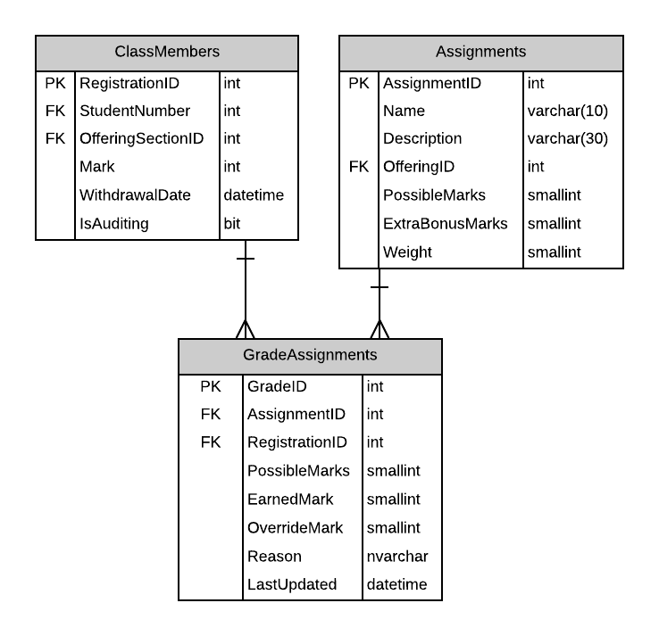

# A19: Grade Assignments (Not Available)

::: danger Scenario Not Available
This scenario is not available for selection at this time.
:::

You must do three forms (A, B and C) based on the following database tables.

## Form A

> ****

- **Search Filter:**

## Form B

> ****

- Do not use ObjectDataSource controls; all data binding should happen in the code-behind of the form.

## Form C

> ****

- Avoid the use of code-behind in the form wherever possible.

## Recommended Stored Procedures

The following specialty stored procedures are available:

- **Form A** - Single Item Create/Read/Update/Delete
  - GradeAssignments
- **Form B** - Gridview Lookup with Code-Behind
  - GradeAssignments by ClassMember
- **Form C** - Gridview Lookup with ObjectDataSource controls
  - GradeAssignments by ClassMember

**Recommended Stored Procedures** - The following specialty stored procedures are available:

**Important Notes:**
