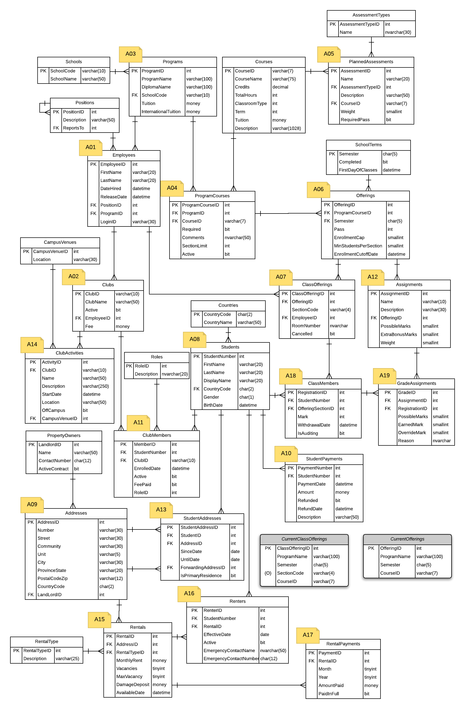

# Star-TED - Lab Selection

> Star-TED – V 2016.2.12.143

This document contains up to 20 distinct scenarios for simple CRUD operations on the **StarTED** database. Not all scenarios are active.

## Lab Scenario Selection

> **Fall 2022** - Scenarios will be assigned by your instructor.

### Database Tables and Foreign Keys

Each scenario has an ERD (Entity Relationship Diagram) of the database tables for that scenario. Students are responsible to create the lab code for those tables in their scenario's ERD; development for additional tables is not required.

----

## Scenarios

|                                    |                                 |                                  |                                 |
| ---------------------------------- | ------------------------------- | -------------------------------- | ------------------------------- |
| [A01: Employees](A01.md)           | [A02: Clubs](A02.md)            | [A03: Programs](A03.md)          | [A04: Program Courses](A04.md)  |
| [A05: Planned Assessments](A05.md) | [A06: Offerings](A06.md)        | [A07: Class Offerings](A07.md)   | [A08: Students](A08.md)         |
| [A09: Addresses](A09.md)           | [A10: Student Payments](A10.md) | [A11: Club Members](A11.md)      | [A12: Assignments](A12.md)      |
| [A13: Student Addresses](A13.md)   | [A14: Club Activities](A14.md)  | [A15: Rentals](A15.md)           | [A16: Renters](A16.md)          |
| [A17: Rental Payments](A17.md)     | [A18: Class Members](A18.md)    | [A19: Grade Assignments](A19.md) | [A20: *TBA*](#)                 |

## ERD

